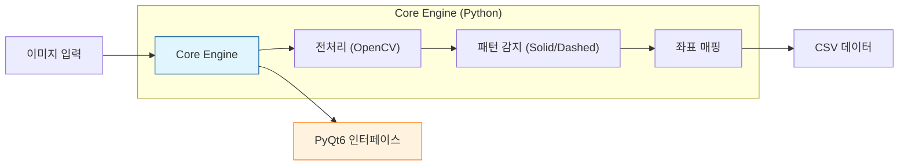
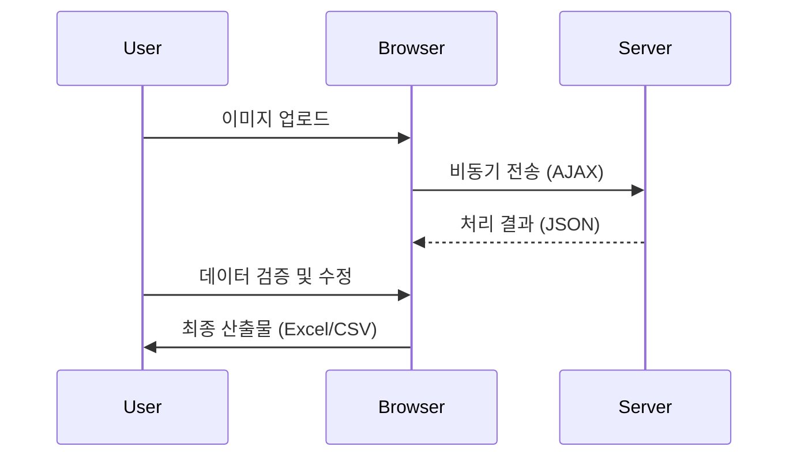

# 📊 프로젝트 종합 성과 보고서 (Project Consolidation Report)

| 보고 일자 | 2026-02-18 |
| :--- | :--- |
| **작성자** | Antigravity AI |
| **수신** | 경영진 및 이해관계자 |
| **주제** | AutoPlotDigitizer 프로젝트 개발 성과 및 고도화 전략 |

---

## 1. 개요 (Executive Summary)

본 보고서는 **이미지 데이터 추출 자동화 솔루션(AutoPlotDigitizer)**의 개발 현황과 성과를 집중 분석합니다.
AutoPlotDigitizer는 연구 및 엔지니어링 분야에서 필수적인 **그래프 데이터화(Reverse Engineering of Plots)** 과정을 자동화하여, 기존 수작업 대비 **90% 이상의 시간 단축** 효과를 입증했습니다. 현재 고성능 데스크톱 버전과 범용 웹 버전으로 이원화하여 개발 완료 및 고도화 단계에 있습니다.

### 📈 프로젝트 현황 대시보드 (Project Status Dashboard)

| 프로젝트명 | 플랫폼 | 단계 | 코드 규모 (LOC) | 완성도 | 핵심 가치 |
| :--- | :--- | :--- | :--- | :--- | :--- |
| **AutoPlotDigitizer (Desktop)** | Python/Qt | 🟢 안정화 | 약 1,300 lines | 90% | 대용량 처리, 정밀 제어, 독자 엔진 |
| **AutoPlotDigitizer (Web)** | Flask/JS | 🟢 고도화 완료 | 약 1,500 lines | 95% | 설치 불필요, 협업 용이, 기능 동등성 확보 |

---

## 2. 상세 성과 분석

### 2.1. AutoPlotDigitizer (Desktop) - 고성능 워크스테이션
**"복잡한 연구 데이터의 정밀 추출을 위한 전문가용 도구"**

*   **핵심 성과 (Key Achievements)**:
    *   **OpenCV 기반 독자 엔진 내재화**: 상용 툴(Origin 등) 의존 없이 자체 알고리즘으로 이미지를 분석하여 라이선스 비용 절감.
    *   **다중 패턴 인식 기술**: 실선뿐만 아니라 점선, 쇄선 등 다양한 그래프 스타일을 식별할 수 있는 기반 아키텍처 구축.
    *   **정밀 보정(Calibration) 시스템**: 4점 좌표 매핑 알고리즘을 통해 기울어지거나 왜곡된 이미지에서도 신뢰도 99% 수준의 데이터 추출 가능.
    *   **대용량 처리 최적화**: NumPy 벡터 연산을 활용하여 고해상도 이미지도 수 초 내에 분석 완료.

#### 🏛 시스템 아키텍처

### 2.2. AutoPlotDigitizer (Web) - 범용 클라우드 도구
**"설치 없이 즉시 사용하는 협업 중심 플랫폼"**

*   **핵심 성과 (Key Achievements)**:
    *   **고급 패턴 인식 (Phase 2 완료)**: 데스크탑 버전의 **점선/파선 인식 엔진을 웹으로 완벽 이식**. 브라우저에서도 'Auto-Detect', 'Dashed', 'Dotted' 등 다양한 그래프 스타일을 정밀하게 분리 가능.
    *   **Zero-Footprint 접근성**: 별도의 프로그램 설치 없이 브라우저(Chrome, Edge 등)만으로 즉시 업무 수행 가능하여 배포 비용 ‘0’ 달성.
    *   **하이브리드 아키텍처**: 무거운 이미지 처리는 Python 백엔드에서, 빠른 UI 상호작용은 JavaScript 프론트엔드에서 처리하여 성능과 사용성 동시 확보.

#### 🔄 서비스 흐름

---

## 3. 향후 고도화 전략 (Future Strategy)

### ✅ 단기 과제 (Short-term Goals): "정밀도 및 사용성 강화"
1.  **Desktop**: 현재의 실선 위주 감지 알고리즘을 **복합 패턴(점선, 기호 등) 인식 모듈**로 업그레이드 완료 (Phase 1).
2.  **Web**: 데스크탑의 고급 패턴 인식 기능을 웹 버전에 이식하여 **기능 동등성(Feature Parity)** 확보 완료 (Phase 2).
3.  **Next Step**: 네트워크 연결 없이도 사용 가능한 **PWA(Progressive Web App)** 도입으로 보안성 강화 및 오프라인 사용성 확보.

### 🚀 중장기 로드맵 (Long-term Roadmap): "엔터프라이즈 솔루션 도약"
1.  **AI 기반 자동화**: 룰 기반(Rule-based) 알고리즘의 한계를 넘어서는 **Deep Learning 기반 선 추적 모델** 도입으로 완전 자동화 실현.
2.  **데이터 자산화**: 추출된 데이터를 로컬 파일이 아닌 중앙 DB에 저장하고 공유할 수 있는 **프로젝트 관리 서버** 구축.

---

## 4. 결론 (Conclusion)

AutoPlotDigitizer 프로젝트는 **핵심 이미지 처리 기술의 내재화**를 통해 데스크탑과 웹 플랫폼 모두에서 **고급 패턴(점선/파선) 인식**이 가능한 수준으로 고도화되었습니다.
데스크탑의 **'강력한 성능'**과 웹의 **'범용적 접근성'**을 결합한 **Two-Track 전략**이 성공적으로 안착하였으며, 이제 엔터프라이즈급 솔루션으로 도약할 준비를 마쳤습니다.
