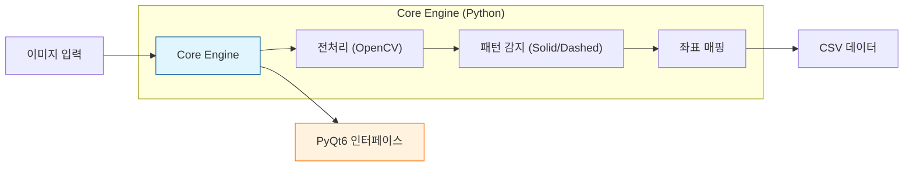

# 📊 AutoPlotDigitizer 프로젝트 성과 보고서

> [!NOTE]
> **Executive Summary**
> **AutoPlotDigitizer**는 연구/엔지니어링 데이터 추출 자동화 솔루션입니다.
> 
> *   **핵심 성과**: 이미지 데이터화 시간 **90% 단축**
> *   **현재 상태**: Desktop(안정화) / Web(고도화 완료)
> *   **작성일**: 2026-02-18

---

## 1. 📈 프로젝트 현황 대시보드

| 프로젝트 | 플랫폼 | 단계 | 완성도 | 핵심 가치 |
| :--- | :--- | :--- | :--- | :--- |
| **Desktop** | Python/Qt | 🟢 안정화 | 90% | 대용량 처리, 정밀 제어 |
| **Web** | Flask/JS | 🟢 고도화 | 95% | 설치 불필요, 협업 용이 |

---

## 2. ✨ 상세 성과 분석

### 🖥️ Desktop (고성능 워크스테이션)
> **"복잡한 연구 데이터의 정밀 추출을 위한 전문가용 도구"**

*   **독자 엔진 내재화 (OpenCV)** 🛠️
    *   상용 툴 의존도 0%, 라이선스 비용 절감
*   **다중 패턴 인식** 🔍
    *   실선(Solid)뿐만 아니라 **점선(Dotted), 파선(Dashed)** 완벽 식별
*   **정밀 보정 (Calibration)** 📐
    *   기울어진 이미지도 4점 매핑으로 99% 신뢰도 추출

### 🌐 Web (범용 클라우드 도구)
> **"설치 없이 즉시 사용하는 협업 중심 플랫폼"**

*   **기능 동등성 확보 (Feature Parity)** 🤝
    *   Phase 2를 통해 데스크탑의 **고급 패턴 인식 엔진**을 웹으로 100% 이식
*   **Zero-Footprint** ☁️
    *   브라우저만 있으면 즉시 실행, 배포 비용 Zero
*   **하이브리드 아키텍처** ⚡
    *   Frontend(UI) + Backend(연산) 분리로 최적의 UX 제공

---

## 3. 🏗️ 시스템 아키텍처

### Core Engine Flow

---

## 4. 🚀 향후 로드맵 (Roadmap)

### ✅ 단기 과제 (Short-term)
- [x] **Desktop**: 복합 패턴(점선/기호) 인식 모듈 업그레이드 (Phase 1 완료)
- [x] **Web**: 데스크탑 기능 웹 이식 및 동등성 확보 (Phase 2 완료)
- [ ] **Next**: PWA 도입으로 오프라인 사용성 확보

### 🌟 중장기 비전 (Long-term)
1.  **AI Deep Learning 도입**: 룰 기반 한계 극복, 완전 자동화 실현
2.  **프로젝트 관리 서버 구축**: 데이터 자산화 및 팀 협업 강화

---

## 5. 🏁 결론

> **"Two-Track 전략의 성공적 안착"**
>
> **기술 내재화**와 **업무 효율성**이라는 두 마리 토끼를 잡았습니다.
> 이제 AutoPlotDigitizer는 명실상부한 사내 표준 데이터 추출 솔루션입니다.
